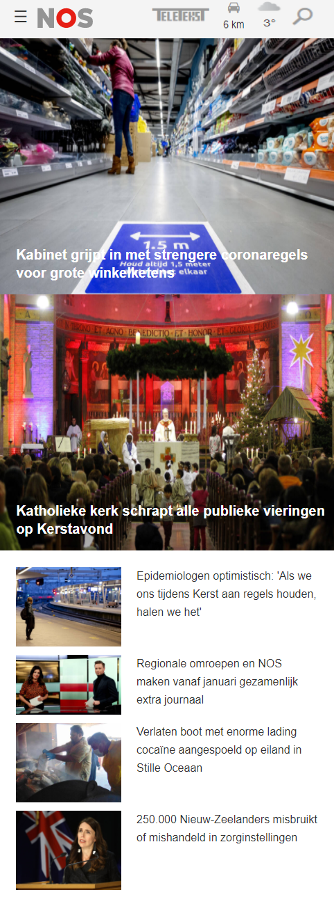
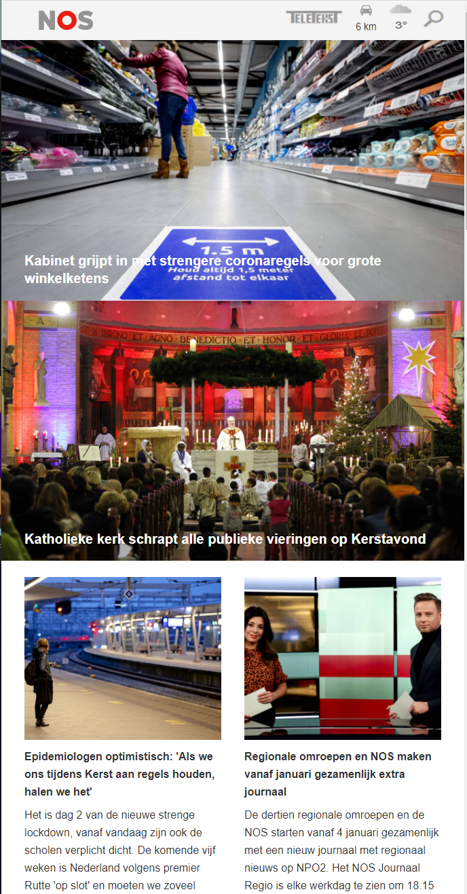
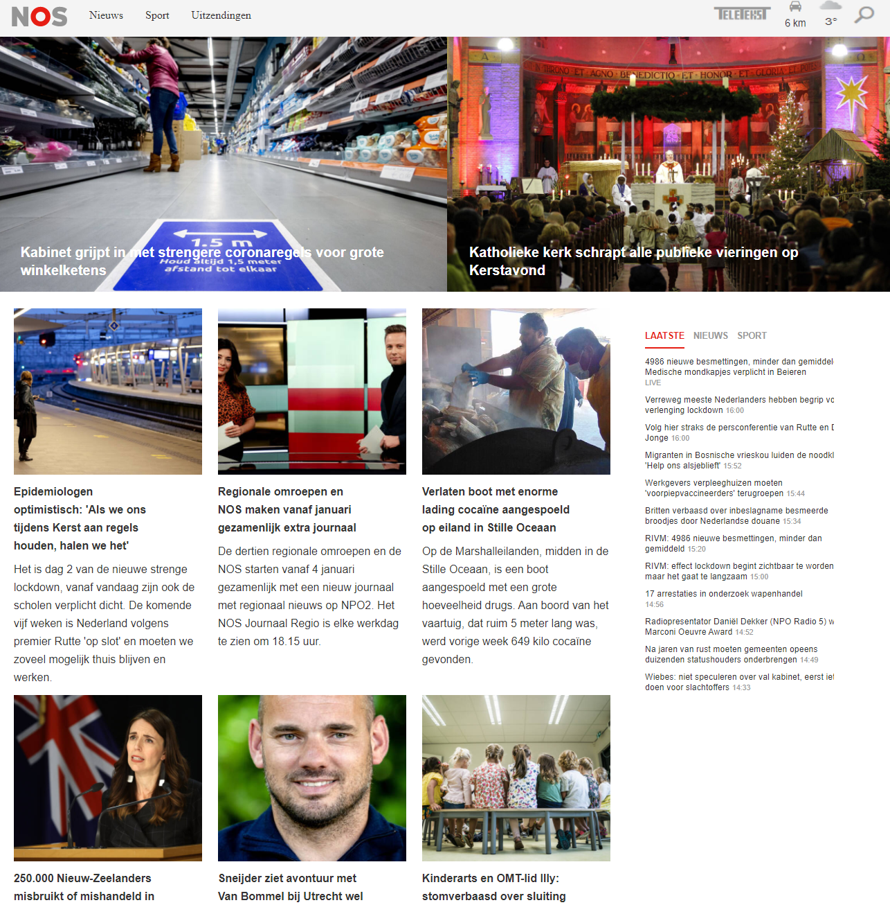
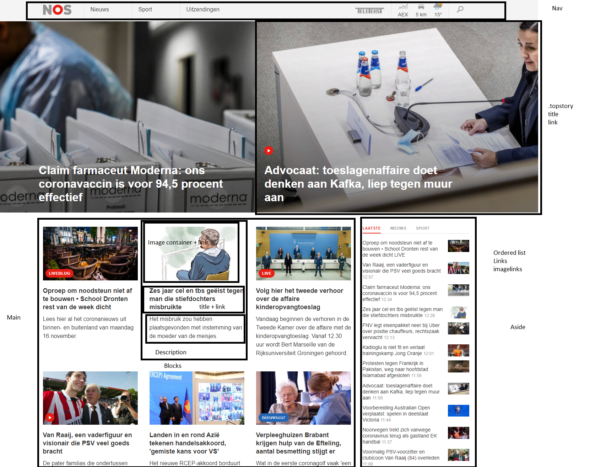
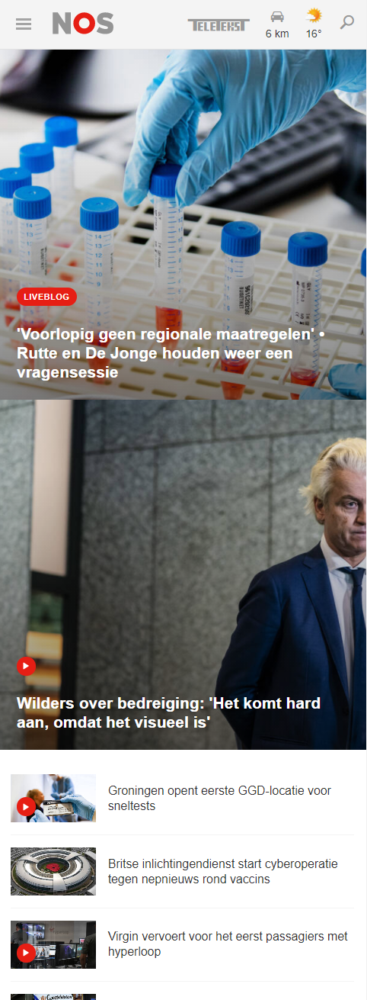
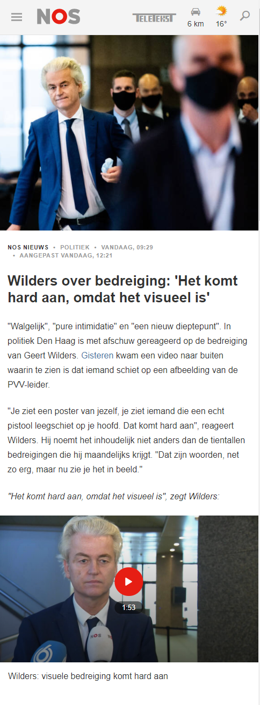

# Procesverslag
**Auteur:** Floris van Schie

Markdown cheat cheet: [Hulp bij het schrijven van Markdown](https://github.com/adam-p/markdown-here/wiki/Markdown-Cheatsheet). Nb. de standaardstructuur en de spartaanse opmaak zijn helemaal prima. Het gaat om de inhoud van je procesverslag. Besteedt de tijd voor pracht en praal aan je website.

## Bronnenlijst
- www.nos.nl
- Marvin Sernee :-)
- https://css-tricks.com/snippets/css/a-guide-to-flexbox/

## Eindgesprek (week 7/8)

Ik moet nog het een en ander doen aan mijn CSS, vooral qua positionering, opzich heb ik alle elementen wel die ik wil laten zien, maar moet ik nog een aside hebben die rechts uitlijnt bijvoorbeeld.

**Screenshot(s):**

## Voortgang 3 (week 6)
Veel gedaan aan css deze week, o.a. positionering van elementen. Mobile versie (niet responsive) zit vrij goed in elkaar zo. De volgende stap is om te proberen om alles ook schaalbaar mogelijk te maken, en dit gaat heel erg lastig worden voor mij. Ik hoop dat ik hier hulp kan inschakelen van een studentassistent. 

## Voortgang 2 (week 5)
De basis gelegd aan mijn CSS. Blijkt gewoon heel erg lastig te zijn, vooral om alles ook op redelijke wijze schaalbaar te maken. De NOS-site heeft wel het een en ander qua structuur al vrij goed staan, wat wel heel erg helpt. 

## Voortgang 1 (week 3)
Ik heb het idee dat mijn HTML redelijk klopt. Ik denk dat CSS voor mij het lastigste gaat worden. Ik heb best een redelijke HTML basis staan op dit moment! Het is semantisch ook relatief correct, heb ik het idee. Ik maak verder ook niet 'nutteloos' gebruik van div'jes en ID's en heb telkens alles gedeclareerd met first of type in mijn css.

### Stand van zaken
Wat goed ging is dat ik  al vrij ver was met de opbouw van mijn HTML. Hierin liep ik een beetje voor op de rest van mijn studiegenoten.

**Screenshot(s):**

-screenshot(s) van hoe ver je bent met korte uitleg-

### Agenda voor meeting

We hebben het format dat iedereen met wat punten aankwam 
### Verslag van meeting

Opzich heb ik de hoofdlijnen wel redelijk op orde staan. De HTML kan ik echter nog beter doen: zo moet ik bijvoorbeeld meer in volgorde neerzetten naar hoe ik het uiteindelijk ook op de website moet laten zien.

## Breakdownschets (week 1)

## Intake (week 1)
-uitwerken voor de kick-off werkgroep - begin van de eerste week-

**Je startniveau:** Blauw

**Je focus:** Responsive

**Je opdracht:** https://nos.nl/

**Screenshot(s) van de eerste pagina (small screen):**

**Screenshot(s) van de tweede pagina (small screen):**

